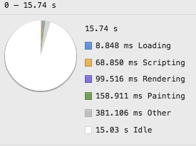
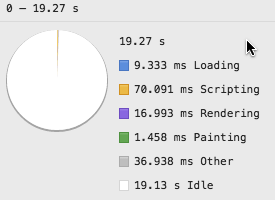

# Your users deserve great performance

Modern web development is all about performance and giving users a native-like experience. Any 
delay is fatal and people will stop using your app and move to a native alternative instead. You can not afford this, as your very own livelyhood is at stake. With every millisecond your end users wait or are delayed you are one step closer to homelessness. Let's face it, this is not good. 

Luckily enough, JavaScript and modern development tooling and practices give us the chance to counteract this problem and save you from a life on the street.

# Redact.js to the rescue


Redact.js is an opionated micro-framework that rocket-boosts your apps. Simply by including it on the bottom of your HTML solutions (or use Jade, like real developers do) you can save hundreds of milliseconds and avoid any jank or dropped frames. 

Simply by avoiding the rendering of the HTML, you can achieve incredible performance benefits that are measureable in our developer tools.

**Redact.js is a fool-proof way to achieve buttery-smooth 60 FPS! It works 90% of the time all the time!**  

```html
<!doctype html>
<html lang="en">
<head>…</head>
<body>
…
<script src="redact.min.js"></script>
</body>
</html>
```

# Proven performance optimisation without any effort using Redact.js

A quick analysis using the Chrome Timeline tool shows you how Redact.js turns a badly performing image carousel full of unneccesary progressive enhancement and using jank-inducing drop shadows and absolute positioning into a lightning-fast experience that is a magical moment for all your users, regardless of platform or device. iPhone 5 users should get almost the same performance than iPhone 6 users, and let's be fair, they should upgrade anyways.

| Without Redact.js| With Redact.js|
| ------------- |:-------------:| -----:|
| ||

As you can see, in the same amount of time heavy user interaction on the Redact.js-enhanced app there was roughly 1/8th of the rendering time and a whopping 1/100th in Paint performance. 

These numbers don't lie! Do yourself a favour and use Redact.js now! 

# Redact.js is open source and on GitHub

The best thing? Redact.js is free an open source and on GitHub. Licensed under GNU.


